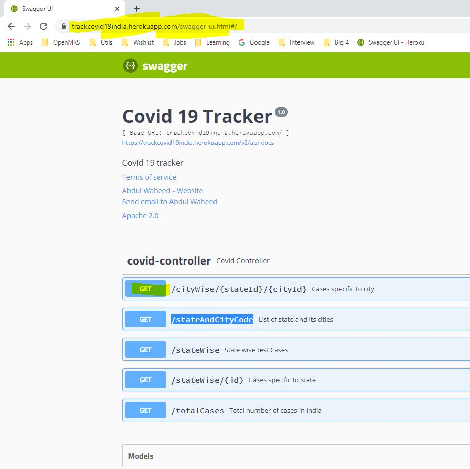

Covid Tracker : App to track Indian cases
============================================

Copyright (c) 2020, [WaheedTechblog](http://www.waheedtechblog.com/).

Contributor: Abdul Waheed [abdulwaheed18@gmail.com]

[https://github.com/abdulwaheed18/covidtracker](https://github.com/abdulwaheed18/covidtracker)

**CovidTracker** API exposes below endpoint

- /totalCases : Number of Covid cases in India
- /stateWise : Share stats based on number of cases state wise
- /stateWise/{id} : fetch data specific to State
- /cityWise/{stateId}/{cityId} : Fetch data for any specific city
- /stateAndCityCode :  This will expose State and its city code

This is Spring Boot Application, So just clone, import to your IDE and run CovidTrackerApplication class

Once your application is up and running, hit below endpoint to see Swagger page
http://localhost:8080/swagger-ui.html

This API is also deployed on Heroku platform
https://trackcovid19india.herokuapp.com/swagger-ui.html

